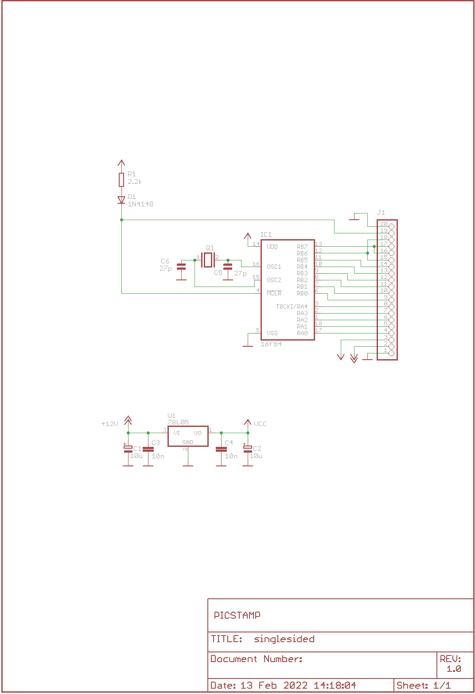

eagexp can export [Eagle][3] 6.6.0 partlist or image (2D/3D) of schematic or board in headless mode.


Links:
 * home: https://github.com/ponty/eagexp
 * PYPI: https://pypi.python.org/pypi/eagexp


Features:
 - Eagle 6.6.0 support only
 - written in Python
 - it can be used as library or as a command line program
 - headless processing using [Xvfb][1] and [pyvirtualdisplay][2]
 - timeout
 - 3D image export using Eagle3D and [povray][4]
 - calculate airwires
 - tested only on Linux
 
Known problems:
 - slow: eagle is opened and closed for each export
 - high DPI does not work (memory problem?)
   
How it works
============

- start [Xvfb][1] headless X server using [pyvirtualdisplay][2]
- redirect eagle display to Xvfb server by setting $DISPLAY variable.
- start [eagle][3] with EXPORT and QUIT commands


Installation
============

 * install [eagle][3]
 * install [povray][4] (optional for 3D)
 * install [Pillow][5]
 * install [pyvirtualdisplay][2] , [Xvfb][1]
 * install eagexp:

```sh
$ python3 -m pip install eagexp
```

On Ubuntu 16.04 

```sh
$ sudo dpkg --add-architecture i386
$ sudo apt-get install eagle
$ sudo apt-get install povray  python-pil xvfb
$ python3 -m  pip install eagexp
```

Eagle was dropped from the Ubuntu repository in the later versions.

On Ubuntu 18.04 

```sh
$ sudo dpkg --add-architecture i386
$ EAGLE_DEB=$(mktemp --suffix .deb); wget -O $EAGLE_DEB 'http://archive.ubuntu.com/ubuntu/pool/multiverse/e/eagle/eagle_6.6.0-2_i386.deb' 
$ sudo apt-get install $EAGLE_DEB
$ sudo apt-get install povray  python-pil xvfb
$ python3 -m  pip install eagexp
```

On Ubuntu 20.04 

```sh
$ TEMP_DEB=$(mktemp --suffix .deb)
$ wget -O $TEMP_DEB 'http://archive.ubuntu.com/ubuntu/pool/multiverse/e/eagle/eagle_6.6.0-2_i386.deb' 
$ dpkg-deb -x $TEMP_DEB /tmp/PackageFolder
$ dpkg-deb --control $TEMP_DEB /tmp/PackageFolder/DEBIAN
$ sed -i -e 's/libssl1.0.0/libssl1.1/g' /tmp/PackageFolder/DEBIAN/control      
$ dpkg -b /tmp/PackageFolder /tmp/eagle.deb
$ sudo apt-get install -y /tmp/eagle.deb
$ sudo ln -s /usr/lib/i386-linux-gnu/libssl.so.1.1 /usr/lib/i386-linux-gnu/libssl.so.1.0.0
$ sudo ln -s /usr/lib/i386-linux-gnu/libcrypto.so.1.1 /usr/lib/i386-linux-gnu/libcrypto.so.1.0.0
$ sudo apt-get install povray  python-pil xvfb
$ python3 -m  pip install eagexp
```

On Ubuntu 22.04 

```sh
$ TEMP_DEB=$(mktemp --suffix .deb)
$ wget -O $TEMP_DEB 'http://archive.ubuntu.com/ubuntu/pool/multiverse/e/eagle/eagle_6.6.0-2_i386.deb' 
$ dpkg-deb -x $TEMP_DEB /tmp/PackageFolder
$ dpkg-deb --control $TEMP_DEB /tmp/PackageFolder/DEBIAN
$ sed -i -e 's/libssl1.0.0/libssl3/g' /tmp/PackageFolder/DEBIAN/control      
$ dpkg -b /tmp/PackageFolder /tmp/eagle.deb
$ sudo apt-get install -y /tmp/eagle.deb
$ sudo ln -s /usr/lib/i386-linux-gnu/libssl.so.3 /usr/lib/i386-linux-gnu/libssl.so.1.0.0
$ sudo ln -s /usr/lib/i386-linux-gnu/libcrypto.so.3 /usr/lib/i386-linux-gnu/libcrypto.so.1.0.0
$ sudo apt-get install povray  python-pil xvfb
$ python3 -m  pip install eagexp
```

Export from python code
=======================

Example:

```py
# eagexp/examples/image_example.py

"""
Example for image export with various options
"""

from eagexp import image

brd = "/usr/share/eagle/projects/examples/tutorial/demo2.brd"

if __name__ == "__main__":
    # set resolution in DPI
    image.export_image(brd, "api_brd_50.png", resolution=50)
    image.export_image(brd, "api_brd_100.png", resolution=100)
    image.export_image(brd, "api_brd_150.png", resolution=150)

    # mirror image
    image.export_image(brd, "api_brd_mirror.png", mirror=True)

    # display only 2 layers
    image.export_image(brd, "api_brd_layer.png", layers=["dimension", "pads"])

    # display layer using eagle command
    image.export_image(brd, "api_brd_command.png", command="display none dimension")

```

<!-- embedme doc/gen/python3_-m_eagexp.examples.image_example.txt -->
Run it:
```sh
$ python3 -m eagexp.examples.image_example

```

Result:


Example for 3D:

```py
# eagexp/examples/image3d_example.py

"""
Example for 3D image export
"""
from eagexp import image3d

brd = "/usr/share/eagle/projects/examples/tutorial/demo2.brd"

if __name__ == "__main__":
    image3d.export_image3d(brd, "api_3d.png")

    # size
    image3d.export_image3d(brd, "api_3d_size1.png", size=(50, 50))
    image3d.export_image3d(brd, "api_3d_size2.png", size=(50, 100))
    image3d.export_image3d(brd, "api_3d_size3.png", size=(100, 50))

    # rotate
    image3d.export_image3d(
        brd, "api_3d_xrot.png", pcb_rotate=(180, 0, 0), size=(200, 150)
    )
    image3d.export_image3d(
        brd, "api_3d_yrot1.png", pcb_rotate=(0, 45, 0), size=(200, 150)
    )
    image3d.export_image3d(
        brd, "api_3d_yrot2.png", pcb_rotate=(0, 90, 0), size=(200, 150)
    )
    image3d.export_image3d(
        brd, "api_3d_yrot3.png", pcb_rotate=(0, 135, 0), size=(200, 150)
    )

```

Start the example program:
<!-- embedme doc/gen/python3_-m_eagexp.examples.image3d_example.txt -->
```sh
$ python3 -m eagexp.examples.image3d_example

```

Result:


Example for partlist export:

```py
# eagexp/examples/partlist_example.py

import pprint

from eagexp import partlist

sch = "/usr/share/eagle/projects/examples/singlesided/singlesided.sch"
brd = "/usr/share/eagle/projects/examples/singlesided/singlesided.brd"

LINE = "-----------------------------"
pp = pprint.PrettyPrinter(indent=4)

if __name__ == "__main__":
    print("raw_partlist of " + sch)
    print(LINE)
    print(partlist.raw_partlist(sch))
    print(LINE)

    print()

    print("raw_partlist of " + brd)
    print(LINE)
    print(partlist.raw_partlist(brd))
    print(LINE)

    print()

    print("structured_partlist of " + sch)
    pp.pprint(partlist.structured_partlist(sch))

    print()

    print("structured_partlist of " + brd)
    pp.pprint(partlist.structured_partlist(brd))

```

Start the example program:
<!-- embedme doc/gen/python3_-m_eagexp.examples.partlist_example.txt -->
```sh
$ python3 -m eagexp.examples.partlist_example
raw_partlist of /usr/share/eagle/projects/examples/singlesided/singlesided.sch
-----------------------------
Partlist

Exported from singlesided.sch at 13 Feb 2022 14:17:40

EAGLE Version 6.6.0 Copyright (c) 1988-2014 CadSoft

Assembly variant: 

Part     Value          Device          Package      Library        Sheet

C1       10u            E2,5-6          E2,5-6       polcap         1
C2       10u            E2,5-6          E2,5-6       polcap         1
C3       10n            C-EU025-025X050 C025-025X050 rcl            1
C4       10n            C-EU025-025X050 C025-025X050 rcl            1
C5       27p            C2.5/2          C2,5-2       capacitor-wima 1
C6       27p            C2.5/2          C2,5-2       capacitor-wima 1
D1       1N4148         1N4148          DO35-10      diode          1
IC1      16F84          PIC16F84AP      DIL18        microchip      1
J1                      PINHD-1X20      1X20         PINHEAD        1
Q1                      XTAL/S          QS           special        1
R1       2.2k           R-EU_0207/10    0207/10      rcl            1
U1       78L05          78LXXZ          TO92         linear         1

-----------------------------

raw_partlist of /usr/share/eagle/projects/examples/singlesided/singlesided.brd
-----------------------------
Partlist

Exported from singlesided.brd at 13 Feb 2022 14:17:41

EAGLE Version 6.6.0 Copyright (c) 1988-2014 CadSoft

Assembly variant: 

Part     Value          Package      Library        Position (mil)        Orientation

C1       10u            E2,5-6       polcap         (1950 400)            R0
C2       10u            E2,5-6       polcap         (1950 900)            R0
C3       10n            C025-025X050 rcl            (1950 200)            R180
C4       10n            C025-025X050 rcl            (1950 1100)           R180
C5       27p            C2,5-2       capacitor-wima (1700 500)            R270
C6       27p            C2,5-2       capacitor-wima (1250 250)            R90
D1       1N4148         DO35-10      diode          (900 200)             R0
IC1      16F84          DIL18        microchip      (1100 700)            R180
J1                      1X20         PINHEAD        (1050 1400)           R180
Q1                      QS           special        (1550 250)            R0
R1       2.2k           0207/10      rcl            (900 350)             R0
U1       78L05          TO92         linear         (1950 650)            R270

-----------------------------

structured_partlist of /usr/share/eagle/projects/examples/singlesided/singlesided.sch
(   ['part', 'value', 'device', 'package', 'library', 'sheet'],
    [   {   'device': 'E2,5-6',
            'library': 'polcap',
            'package': 'E2,5-6',
            'part': 'C1',
            'sheet': '1',
            'value': '10u'},
        {   'device': 'E2,5-6',
            'library': 'polcap',
            'package': 'E2,5-6',
            'part': 'C2',
            'sheet': '1',
            'value': '10u'},
        {   'device': 'C-EU025-025X050',
            'library': 'rcl',
            'package': 'C025-025X050',
            'part': 'C3',
            'sheet': '1',
            'value': '10n'},
        {   'device': 'C-EU025-025X050',
            'library': 'rcl',
            'package': 'C025-025X050',
            'part': 'C4',
            'sheet': '1',
            'value': '10n'},
        {   'device': 'C2.5/2',
            'library': 'capacitor-wima',
            'package': 'C2,5-2',
            'part': 'C5',
            'sheet': '1',
            'value': '27p'},
        {   'device': 'C2.5/2',
            'library': 'capacitor-wima',
            'package': 'C2,5-2',
            'part': 'C6',
            'sheet': '1',
            'value': '27p'},
        {   'device': '1N4148',
            'library': 'diode',
            'package': 'DO35-10',
            'part': 'D1',
            'sheet': '1',
            'value': '1N4148'},
        {   'device': 'PIC16F84AP',
            'library': 'microchip',
            'package': 'DIL18',
            'part': 'IC1',
            'sheet': '1',
            'value': '16F84'},
        {   'device': 'PINHD-1X20',
            'library': 'PINHEAD',
            'package': '1X20',
            'part': 'J1',
            'sheet': '1',
            'value': ''},
        {   'device': 'XTAL/S',
            'library': 'special',
            'package': 'QS',
            'part': 'Q1',
            'sheet': '1',
            'value': ''},
        {   'device': 'R-EU_0207/10',
            'library': 'rcl',
            'package': '0207/10',
            'part': 'R1',
            'sheet': '1',
            'value': '2.2k'},
        {   'device': '78LXXZ',
            'library': 'linear',
            'package': 'TO92',
            'part': 'U1',
            'sheet': '1',
            'value': '78L05'}])

structured_partlist of /usr/share/eagle/projects/examples/singlesided/singlesided.brd
(   ['part', 'value', 'package', 'library', 'position', '(mil)', 'orientation'],
    [   {   '(mil)': ')',
            'library': 'polcap',
            'orientation': 'R0',
            'package': 'E2,5-6',
            'part': 'C1',
            'position': '(1950 400',
            'value': '10u'},
        {   '(mil)': ')',
            'library': 'polcap',
            'orientation': 'R0',
            'package': 'E2,5-6',
            'part': 'C2',
            'position': '(1950 900',
            'value': '10u'},
        {   '(mil)': ')',
            'library': 'rcl',
            'orientation': 'R180',
            'package': 'C025-025X050',
            'part': 'C3',
            'position': '(1950 200',
            'value': '10n'},
        {   '(mil)': '0)',
            'library': 'rcl',
            'orientation': 'R180',
            'package': 'C025-025X050',
            'part': 'C4',
            'position': '(1950 110',
            'value': '10n'},
        {   '(mil)': ')',
            'library': 'capacitor-wima',
            'orientation': 'R270',
            'package': 'C2,5-2',
            'part': 'C5',
            'position': '(1700 500',
            'value': '27p'},
        {   '(mil)': ')',
            'library': 'capacitor-wima',
            'orientation': 'R90',
            'package': 'C2,5-2',
            'part': 'C6',
            'position': '(1250 250',
            'value': '27p'},
        {   '(mil)': '',
            'library': 'diode',
            'orientation': 'R0',
            'package': 'DO35-10',
            'part': 'D1',
            'position': '(900 200)',
            'value': '1N4148'},
        {   '(mil)': ')',
            'library': 'microchip',
            'orientation': 'R180',
            'package': 'DIL18',
            'part': 'IC1',
            'position': '(1100 700',
            'value': '16F84'},
        {   '(mil)': '0)',
            'library': 'PINHEAD',
            'orientation': 'R180',
            'package': '1X20',
            'part': 'J1',
            'position': '(1050 140',
            'value': ''},
        {   '(mil)': ')',
            'library': 'special',
            'orientation': 'R0',
            'package': 'QS',
            'part': 'Q1',
            'position': '(1550 250',
            'value': ''},
        {   '(mil)': '',
            'library': 'rcl',
            'orientation': 'R0',
            'package': '0207/10',
            'part': 'R1',
            'position': '(900 350)',
            'value': '2.2k'},
        {   '(mil)': ')',
            'library': 'linear',
            'orientation': 'R270',
            'package': 'TO92',
            'part': 'U1',
            'position': '(1950 650',
            'value': '78L05'}])
```

Export schematic from command-line
==================================

Export image
------------

Start the eagexp module directly with python:

<!-- embedme doc/gen/python3_-m_eagexp.image__usr_share_eagle_projects_examples_singlesided_singlesided.sch_cli_sch.png.txt -->
```sh
$ python3 -m eagexp.image /usr/share/eagle/projects/examples/singlesided/singlesided.sch cli_sch.png

```
  
<!--  -->



Export partlist
---------------

Start the eagexp module directly with python:

<!-- embedme doc/gen/python3_-m_eagexp.partlist__usr_share_eagle_projects_examples_singlesided_singlesided.sch.txt -->
```sh
$ python3 -m eagexp.partlist /usr/share/eagle/projects/examples/singlesided/singlesided.sch
Partlist

Exported from singlesided.sch at 13 Feb 2022 14:18:05

EAGLE Version 6.6.0 Copyright (c) 1988-2014 CadSoft

Assembly variant: 

Part     Value          Device          Package      Library        Sheet

C1       10u            E2,5-6          E2,5-6       polcap         1
C2       10u            E2,5-6          E2,5-6       polcap         1
C3       10n            C-EU025-025X050 C025-025X050 rcl            1
C4       10n            C-EU025-025X050 C025-025X050 rcl            1
C5       27p            C2.5/2          C2,5-2       capacitor-wima 1
C6       27p            C2.5/2          C2,5-2       capacitor-wima 1
D1       1N4148         1N4148          DO35-10      diode          1
IC1      16F84          PIC16F84AP      DIL18        microchip      1
J1                      PINHD-1X20      1X20         PINHEAD        1
Q1                      XTAL/S          QS           special        1
R1       2.2k           R-EU_0207/10    0207/10      rcl            1
U1       78L05          78LXXZ          TO92         linear         1

```

Export board from command-line
==============================

Export image
------------

Start the eagexp module directly with python:

<!-- embedme doc/gen/python3_-m_eagexp.image__usr_share_eagle_projects_examples_singlesided_singlesided.brd_cli_brd.png.txt -->
```sh
$ python3 -m eagexp.image /usr/share/eagle/projects/examples/singlesided/singlesided.brd cli_brd.png

```


Export 3D image
---------------

Start the eagexp module directly with python:

<!-- embedme doc/gen/python3_-m_eagexp.image3d__usr_share_eagle_projects_examples_singlesided_singlesided.brd_cli_3d.png.txt -->
```sh
$ python3 -m eagexp.image3d /usr/share/eagle/projects/examples/singlesided/singlesided.brd cli_3d.png

```


Export partlist
---------------

Start the eagexp module directly with python:

<!-- embedme doc/gen/python3_-m_eagexp.partlist__usr_share_eagle_projects_examples_singlesided_singlesided.brd.txt -->
```sh
$ python3 -m eagexp.partlist /usr/share/eagle/projects/examples/singlesided/singlesided.brd
Partlist

Exported from singlesided.brd at 13 Feb 2022 14:18:10

EAGLE Version 6.6.0 Copyright (c) 1988-2014 CadSoft

Assembly variant: 

Part     Value          Package      Library        Position (mil)        Orientation

C1       10u            E2,5-6       polcap         (1950 400)            R0
C2       10u            E2,5-6       polcap         (1950 900)            R0
C3       10n            C025-025X050 rcl            (1950 200)            R180
C4       10n            C025-025X050 rcl            (1950 1100)           R180
C5       27p            C2,5-2       capacitor-wima (1700 500)            R270
C6       27p            C2,5-2       capacitor-wima (1250 250)            R90
D1       1N4148         DO35-10      diode          (900 200)             R0
IC1      16F84          DIL18        microchip      (1100 700)            R180
J1                      1X20         PINHEAD        (1050 1400)           R180
Q1                      QS           special        (1550 250)            R0
R1       2.2k           0207/10      rcl            (900 350)             R0
U1       78L05          TO92         linear         (1950 650)            R270

```

airwires
--------

```py
# eagexp/examples/airwires.py

from eagexp.airwires import airwires

brd1 = "/usr/share/eagle/projects/examples/singlesided/singlesided.brd"
brd2 = "/usr/share/eagle/projects/examples/tutorial/demo2.brd"

if __name__ == "__main__":
    print(airwires(brd1))
    print(airwires(brd2))

```

<!-- embedme doc/gen/python3_-m_eagexp.examples.airwires.txt -->
```sh
$ python3 -m eagexp.examples.airwires
39
0
```    
    
Command-line help
=================


<!-- embedme doc/gen/python3_-m_eagexp.image_--help.txt -->
```sh
$ python3 -m eagexp.image --help
usage: image.py [-h] [-t TIMEOUT] [-p PALETTE] [-r RESOLUTION] [-l LAYERS]
                [-c COMMAND] [-m] [-s] [--debug] [--version]
                input output

Exporting eagle .sch or .brd file into image file. If export is blocked
somehow (e.g. popup window is displayed) then after timeout operation is
canceled with exception. Problem can be investigated by setting 'showgui'
flag. Exporting generates an image file. Only PNG format is supported

positional arguments:
  input                 eagle .sch or .brd file name
  output                image file name (e.g. 'eagle.png')

optional arguments:
  -h, --help            show this help message and exit
  -t TIMEOUT, --timeout TIMEOUT
                        operation is canceled after this timeout (sec)
  -p PALETTE, --palette PALETTE
                        background color [None,black,white,colored]
  -r RESOLUTION, --resolution RESOLUTION
                        image resolution in dpi (50..2400)
  -l LAYERS, --layers LAYERS
                        list, layers to be displayed ['top','pads']
  -c COMMAND, --command COMMAND
                        string, direct eagle command
  -m, --mirror          Bool
  -s, --showgui         eagle GUI is displayed
  --debug               set logging level to DEBUG
  --version             show program's version number and exit
```

<!-- embedme doc/gen/python3_-m_eagexp.image3d_--help.txt -->
```sh
$ python3 -m eagexp.image3d --help
usage: image3d.py [-h] [-s SIZE] [-p PCB_ROTATE] [-t TIMEOUT] [--showgui]
                  [--debug] [--version]
                  input output

Exporting eagle .brd file into 3D image file using Eagle3D and povray. If
export is blocked somehow (e.g. popup window is displayed) then after timeout
operation is canceled with exception. Problem can be investigated by setting
'showgui' flag.

positional arguments:
  input                 eagle .brd file name
  output                image file name (.png)

optional arguments:
  -h, --help            show this help message and exit
  -s SIZE, --size SIZE  tuple(width, size), image size
  -p PCB_ROTATE, --pcb-rotate PCB_ROTATE
  -t TIMEOUT, --timeout TIMEOUT
                        operation is canceled after this timeout (sec)
  --showgui             eagle GUI is displayed
  --debug               set logging level to DEBUG
  --version             show program's version number and exit
```

<!-- embedme doc/gen/python3_-m_eagexp.partlist_--help.txt -->
```sh
$ python3 -m eagexp.partlist --help
usage: partlist.py [-h] [-t TIMEOUT] [-s] [--debug] [--version] input

print partlist text delivered by eagle

positional arguments:
  input                 .sch or .brd file name

optional arguments:
  -h, --help            show this help message and exit
  -t TIMEOUT, --timeout TIMEOUT
                        int
  -s, --showgui         Bool, True -> do not hide eagle GUI
  --debug               set logging level to DEBUG
  --version             show program's version number and exit
```


[1]: http://en.wikipedia.org/wiki/Xvfb
[2]: https://github.com/ponty/PyVirtualDisplay
[3]: http://www.cadsoftusa.com/
[4]: https://en.wikipedia.org/wiki/POV-Ray
[5]: https://pypi.org/project/Pillow/


   
