eagexp can export eagle_ partlist or image (2D/3D) of schematic or board.

Links:
 * home: https://github.com/ponty/eagexp
 * documentation: http://eagexp.readthedocs.org
 * PYPI: https://pypi.python.org/pypi/eagexp

|Travis| |Coveralls| |Latest Version| |Supported Python versions| |License| |Downloads| |Code Health| |Documentation|

Features:
 - written in python
 - it can be used as library or as a command line program
 - background processing (only if Xvfb_ and pyvirtualdisplay_ are installed)
 - timeout
 - 3D image export using Eagle3D and povray_
 - calculate airwires
 
Known problems:
 - slow: eagle is opened and closed for each export
 - high DPI does not work (memory problem?)
 - export can be blocked by Eagle -> timeout
 - 3D image export has a lot of options which are not supported
   
Basic usage
===========

    >>> from eagexp import image, partlist
    >>> brd='~/.eagle/projects/examples/singlesided/singlesided.brd'
    >>> image.export_image(brd, 'brd.png', resolution=600)
    >>> print partlist.raw_partlist(brd)

How it works
============

#. start Xvfb_ headless X server using pyvirtualdisplay_
#. redirect eagle display to Xvfb server by setting $DISPLAY variable.
#. start eagle_ with EXPORT and QUIT commands

Installation
============

General
-------

 * install eagle_
 * install povray_ (optional for 3D)
 * install pip_
 * install PIL_
 * install pyvirtualdisplay_ , Xvfb_
 * install the program::

    # as root
    pip install eagexp

Ubuntu 14.04
------------
::

    sudo apt-get install python-pip eagle povray  python-pil xvfb xdotool
    sudo pip install eagexp
    
Uninstall
---------
::

    # as root
    pip uninstall eagexp

Usage
=====

Export from python code
-----------------------

Example::

  #-- include('examples/image_example.py')--#
  '''
  Example for image export with various options
  '''

  from eagexp import image

  brd = '/usr/share/eagle/projects/examples/tutorial/demo2.brd'

  if __name__ == "__main__":
      # set resolution in DPI
      image.export_image(brd, 'api_brd_50.png', resolution=50)
      image.export_image(brd, 'api_brd_100.png', resolution=100)
      image.export_image(brd, 'api_brd_150.png', resolution=150)
      
      # mirror image
      image.export_image(brd, 'api_brd_mirror.png', mirror=True)
      
      # display only 2 layers
      image.export_image(brd, 'api_brd_layer.png', layers=['dimension', 'pads'])
      
      # display layer using eagle command
      image.export_image(
          brd, 'api_brd_command.png', command='display none dimension')
  #-#

Start the example program::

    python -m eagexp.examples.image_example

Result:

..  #-- sh('python -m eagexp.examples.image_example')--#
..  #-#

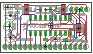

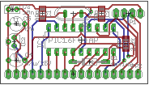

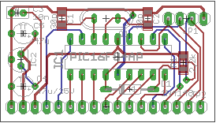

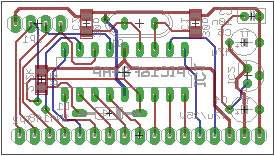

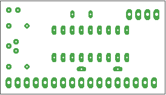

Example for 3D::

  #-- include('examples/image3d_example.py')--#
  '''
  Example for 3D image export
  '''
  from eagexp import image3d

  brd = '/usr/share/eagle/projects/examples/tutorial/demo2.brd'

  if __name__ == "__main__":
      image3d.export_image3d(brd, 'api_3d.png')
      
      # size
      image3d.export_image3d(brd, 'api_3d_size1.png', size=(50, 50))
      image3d.export_image3d(brd, 'api_3d_size2.png', size=(50, 100))
      image3d.export_image3d(brd, 'api_3d_size3.png', size=(100, 50))
      
      # rotate
      image3d.export_image3d(
          brd, 'api_3d_xrot.png', pcb_rotate=(180, 0, 0), size=(200, 150))
      image3d.export_image3d(
          brd, 'api_3d_yrot1.png', pcb_rotate=(0, 45, 0), size=(200, 150))
      image3d.export_image3d(
          brd, 'api_3d_yrot2.png', pcb_rotate=(0, 90, 0), size=(200, 150))
      image3d.export_image3d(
          brd, 'api_3d_yrot3.png', pcb_rotate=(0, 135, 0), size=(200, 150))
  #-#

Start the example program::

    python -m eagexp.examples.image3d_example

Result:

..  #-- sh('python -m eagexp.examples.image3d_example')--#
..  #-#

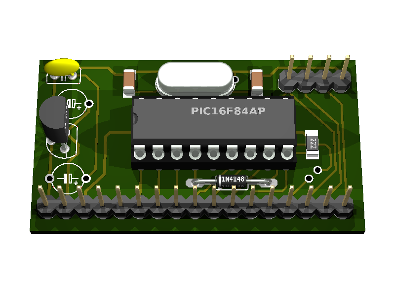
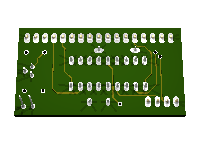
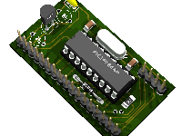
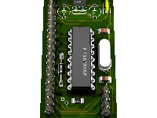
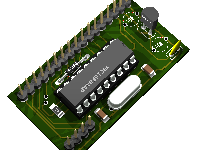
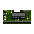

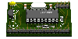

Example for partlist export::

  #-- include('examples/partlist_example.py')--#
  from eagexp import partlist

  sch = '/usr/share/eagle/projects/examples/singlesided/singlesided.sch'
  brd = '/usr/share/eagle/projects/examples/singlesided/singlesided.brd'

  if __name__ == "__main__":
      print( 'raw_partlist of ' + sch )
      print( "'''" )
      print( partlist.raw_partlist(sch) )
      print( "'''" )
      
      print()
      
      print( 'raw_partlist of ' + brd )
      print( "'''" )
      print( partlist.raw_partlist(brd) )
      print( "'''" )
      
      print()
      
      print( 'structured_partlist of ' + sch )
      print( partlist.structured_partlist(sch) )
      
      print()
      
      print( 'structured_partlist of ' + brd )
      print( partlist.structured_partlist(brd) )
  #-#

Start the example program::

  #-- sh('python -m eagexp.examples.partlist_example')--#
  raw_partlist of /usr/share/eagle/projects/examples/singlesided/singlesided.sch
  '''
  Partlist

  Exported from singlesided.sch at 2016.03.05. 8:58

  EAGLE Version 6.5.0 Copyright (c) 1988-2013 CadSoft

  Assembly variant: 

  Part     Value          Device          Package      Library        Sheet

  C1       10u            E2,5-6          E2,5-6       polcap         1
  C2       10u            E2,5-6          E2,5-6       polcap         1
  C3       10n            C-EU025-025X050 C025-025X050 rcl            1
  C4       10n            C-EU025-025X050 C025-025X050 rcl            1
  C5       27p            C2.5/2          C2,5-2       capacitor-wima 1
  C6       27p            C2.5/2          C2,5-2       capacitor-wima 1
  D1       1N4148         1N4148          DO35-10      diode          1
  IC1      16F84          PIC16F84AP      DIL18        microchip      1
  J1                      PINHD-1X20      1X20         PINHEAD        1
  Q1                      XTAL/S          QS           special        1
  R1       2.2k           R-EU_0207/10    0207/10      rcl            1
  U1       78L05          78LXXZ          TO92         linear         1

  '''
  ()
  raw_partlist of /usr/share/eagle/projects/examples/singlesided/singlesided.brd
  '''
  Partlist

  Exported from singlesided.brd at 2016.03.05. 8:58

  EAGLE Version 6.5.0 Copyright (c) 1988-2013 CadSoft

  Assembly variant: 

  Part     Value          Package      Library        Position (mil)        Orientation

  C1       10u            E2,5-6       polcap         (1950 400)            R0
  C2       10u            E2,5-6       polcap         (1950 900)            R0
  C3       10n            C025-025X050 rcl            (1950 200)            R180
  C4       10n            C025-025X050 rcl            (1950 1100)           R180
  C5       27p            C2,5-2       capacitor-wima (1700 500)            R270
  C6       27p            C2,5-2       capacitor-wima (1250 250)            R90
  D1       1N4148         DO35-10      diode          (900 200)             R0
  IC1      16F84          DIL18        microchip      (1100 700)            R180
  J1                      1X20         PINHEAD        (1050 1400)           R180
  Q1                      QS           special        (1550 250)            R0
  R1       2.2k           0207/10      rcl            (900 350)             R0
  U1       78L05          TO92         linear         (1950 650)            R270

  '''
  ()
  structured_partlist of /usr/share/eagle/projects/examples/singlesided/singlesided.sch
  ([u'part', u'value', u'device', u'package', u'library', u'sheet'], [{u'sheet': u'1', u'package': u'E2,5-6', u'library': u'polcap', u'part': u'C1', u'value': u'10u', u'device': u'E2,5-6'}, {u'sheet': u'1', u'package': u'E2,5-6', u'library': u'polcap', u'part': u'C2', u'value': u'10u', u'device': u'E2,5-6'}, {u'sheet': u'1', u'package': u'C025-025X050', u'library': u'rcl', u'part': u'C3', u'value': u'10n', u'device': u'C-EU025-025X050'}, {u'sheet': u'1', u'package': u'C025-025X050', u'library': u'rcl', u'part': u'C4', u'value': u'10n', u'device': u'C-EU025-025X050'}, {u'sheet': u'1', u'package': u'C2,5-2', u'library': u'capacitor-wima', u'part': u'C5', u'value': u'27p', u'device': u'C2.5/2'}, {u'sheet': u'1', u'package': u'C2,5-2', u'library': u'capacitor-wima', u'part': u'C6', u'value': u'27p', u'device': u'C2.5/2'}, {u'sheet': u'1', u'package': u'DO35-10', u'library': u'diode', u'part': u'D1', u'value': u'1N4148', u'device': u'1N4148'}, {u'sheet': u'1', u'package': u'DIL18', u'library': u'microchip', u'part': u'IC1', u'value': u'16F84', u'device': u'PIC16F84AP'}, {u'sheet': u'1', u'package': u'1X20', u'library': u'PINHEAD', u'part': u'J1', u'value': u'', u'device': u'PINHD-1X20'}, {u'sheet': u'1', u'package': u'QS', u'library': u'special', u'part': u'Q1', u'value': u'', u'device': u'XTAL/S'}, {u'sheet': u'1', u'package': u'0207/10', u'library': u'rcl', u'part': u'R1', u'value': u'2.2k', u'device': u'R-EU_0207/10'}, {u'sheet': u'1', u'package': u'TO92', u'library': u'linear', u'part': u'U1', u'value': u'78L05', u'device': u'78LXXZ'}])
  ()
  structured_partlist of /usr/share/eagle/projects/examples/singlesided/singlesided.brd
  ([u'part', u'value', u'package', u'library', u'position', u'orientation'], [{u'orientation': u'R0', u'package': u'E2,5-6', u'library': u'polcap', u'part': u'C1', u'value': u'10u', u'position': u'(1950 400)'}, {u'orientation': u'R0', u'package': u'E2,5-6', u'library': u'polcap', u'part': u'C2', u'value': u'10u', u'position': u'(1950 900)'}, {u'orientation': u'R180', u'package': u'C025-025X050', u'library': u'rcl', u'part': u'C3', u'value': u'10n', u'position': u'(1950 200)'}, {u'orientation': u'R180', u'package': u'C025-025X050', u'library': u'rcl', u'part': u'C4', u'value': u'10n', u'position': u'(1950 1100)'}, {u'orientation': u'R270', u'package': u'C2,5-2', u'library': u'capacitor-wima', u'part': u'C5', u'value': u'27p', u'position': u'(1700 500)'}, {u'orientation': u'R90', u'package': u'C2,5-2', u'library': u'capacitor-wima', u'part': u'C6', u'value': u'27p', u'position': u'(1250 250)'}, {u'orientation': u'R0', u'package': u'DO35-10', u'library': u'diode', u'part': u'D1', u'value': u'1N4148', u'position': u'(900 200)'}, {u'orientation': u'R180', u'package': u'DIL18', u'library': u'microchip', u'part': u'IC1', u'value': u'16F84', u'position': u'(1100 700)'}, {u'orientation': u'R180', u'package': u'1X20', u'library': u'PINHEAD', u'part': u'J1', u'value': u'', u'position': u'(1050 1400)'}, {u'orientation': u'R0', u'package': u'QS', u'library': u'special', u'part': u'Q1', u'value': u'', u'position': u'(1550 250)'}, {u'orientation': u'R0', u'package': u'0207/10', u'library': u'rcl', u'part': u'R1', u'value': u'2.2k', u'position': u'(900 350)'}, {u'orientation': u'R270', u'package': u'TO92', u'library': u'linear', u'part': u'U1', u'value': u'78L05', u'position': u'(1950 650)'}])
  #-#

Export schematic from command-line
----------------------------------

Export image
++++++++++++

Start the eagexp module directly with python::

    python -m eagexp.image ~/.eagle/projects/examples/singlesided/singlesided.sch cli_sch.png

Result:

..  #-- sh('python -m eagexp.image ~/.eagle/projects/examples/singlesided/singlesided.sch cli_sch.png')--#
..  #-#
  
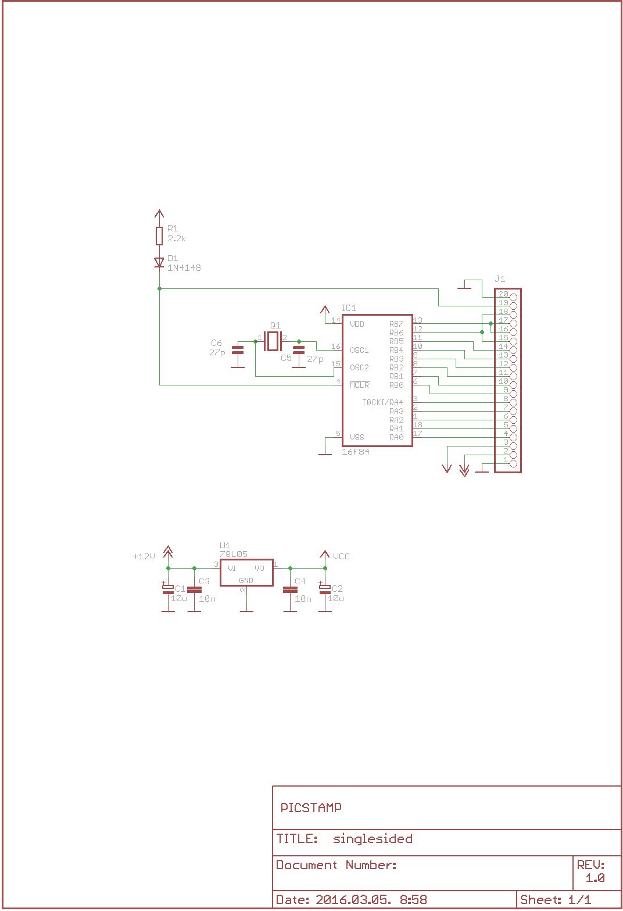

Export partlist
+++++++++++++++

Start the eagexp module directly with python::

  #-- sh('python -m eagexp.partlist /usr/share/eagle/projects/examples/singlesided/singlesided.sch')--#
  Partlist

  Exported from singlesided.sch at 2016.03.05. 8:58

  EAGLE Version 6.5.0 Copyright (c) 1988-2013 CadSoft

  Assembly variant: 

  Part     Value          Device          Package      Library        Sheet

  C1       10u            E2,5-6          E2,5-6       polcap         1
  C2       10u            E2,5-6          E2,5-6       polcap         1
  C3       10n            C-EU025-025X050 C025-025X050 rcl            1
  C4       10n            C-EU025-025X050 C025-025X050 rcl            1
  C5       27p            C2.5/2          C2,5-2       capacitor-wima 1
  C6       27p            C2.5/2          C2,5-2       capacitor-wima 1
  D1       1N4148         1N4148          DO35-10      diode          1
  IC1      16F84          PIC16F84AP      DIL18        microchip      1
  J1                      PINHD-1X20      1X20         PINHEAD        1
  Q1                      XTAL/S          QS           special        1
  R1       2.2k           R-EU_0207/10    0207/10      rcl            1
  U1       78L05          78LXXZ          TO92         linear         1

  #-#

Export board from command-line
------------------------------

Export image
++++++++++++

Start the eagexp module directly with python::

    python -m eagexp.image ~/.eagle/projects/examples/singlesided/singlesided.brd cli_brd.png

Result:

..  #-- sh('python -m eagexp.image ~/.eagle/projects/examples/singlesided/singlesided.brd cli_brd.png')--#
..  #-#

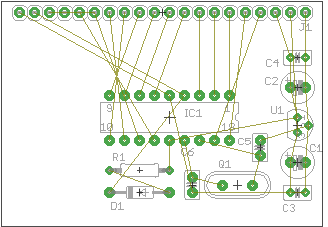

Export 3D image
+++++++++++++++

Start the eagexp module directly with python::

    python -m eagexp.image3d ~/.eagle/projects/examples/singlesided/singlesided.brd cli_3d.png

Result:

..  #-- sh('python -m eagexp.image3d ~/.eagle/projects/examples/singlesided/singlesided.brd cli_3d.png')--#
..  #-#

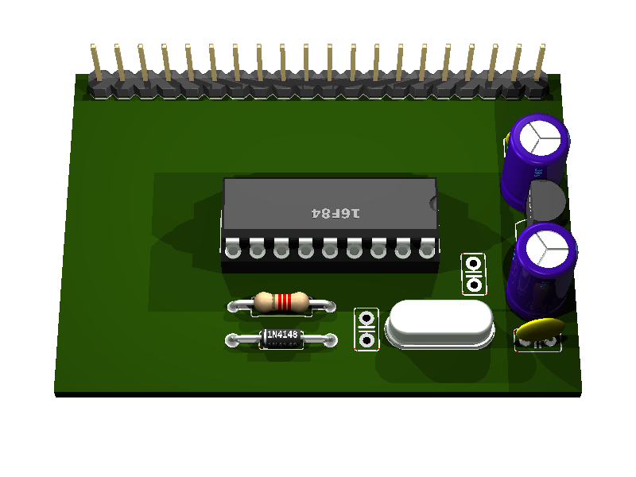

Export partlist
+++++++++++++++

Start the eagexp module directly with python::

  #-- sh('python -m eagexp.partlist /usr/share/eagle/projects/examples/singlesided/singlesided.brd')--#
  Partlist

  Exported from singlesided.brd at 2016.03.05. 8:59

  EAGLE Version 6.5.0 Copyright (c) 1988-2013 CadSoft

  Assembly variant: 

  Part     Value          Package      Library        Position (mil)        Orientation

  C1       10u            E2,5-6       polcap         (1950 400)            R0
  C2       10u            E2,5-6       polcap         (1950 900)            R0
  C3       10n            C025-025X050 rcl            (1950 200)            R180
  C4       10n            C025-025X050 rcl            (1950 1100)           R180
  C5       27p            C2,5-2       capacitor-wima (1700 500)            R270
  C6       27p            C2,5-2       capacitor-wima (1250 250)            R90
  D1       1N4148         DO35-10      diode          (900 200)             R0
  IC1      16F84          DIL18        microchip      (1100 700)            R180
  J1                      1X20         PINHEAD        (1050 1400)           R180
  Q1                      QS           special        (1550 250)            R0
  R1       2.2k           0207/10      rcl            (900 350)             R0
  U1       78L05          TO92         linear         (1950 650)            R270

  #-#

airwires
--------

::

  #-- include('examples/airwires.py')--#
  from eagexp.airwires import airwires

  brd1 = '/usr/share/eagle/projects/examples/singlesided/singlesided.brd'
  brd2 = '/usr/share/eagle/projects/examples/tutorial/demo2.brd'

  if __name__ == "__main__":
      print( airwires(brd1) )    
      print( airwires(brd2) )

  #-#

::
    
  #-- sh('python -m eagexp.examples.airwires')--#
  39
  0
  #-#
    
    
Command-line help
=================

::

  #-- sh('python -m eagexp.image --help')--#
  usage: image.py [-h] [-t TIMEOUT] [-p PALETTE] [-r RESOLUTION] [-l LAYERS]
                  [-c COMMAND] [-m] [-s] [--debug] [--version]
                  input output

  Exporting eagle .sch or .brd file into image file. GUI is not displayed if
  ``pyvirtualdisplay`` is installed. If export is blocked somehow (e.g. popup
  window is displayed) then after timeout operation is canceled with exception.
  Problem can be investigated by setting 'showgui' flag.

  Exporting generates an image file with a format corresponding to the given
  filename extension. The following image formats are available:

  .bmp    Windows Bitmap Files

  .png    Portable Network Graphics Files

  .pbm    Portable Bitmap Files

  .pgm    Portable Grayscale Bitmap Files

  .ppm    Portable Pixelmap Files

  .tif    TIFF Files

  .xbm    X Bitmap Files

  .xpm    X Pixmap Files

  positional arguments:
    input                 eagle .sch or .brd file name
    output                image file name, existing file will be removed first!

  optional arguments:
    -h, --help            show this help message and exit
    -t TIMEOUT, --timeout TIMEOUT
                          operation is canceled after this timeout (sec)
    -p PALETTE, --palette PALETTE
                          background color [None,black,white,colored]
    -r RESOLUTION, --resolution RESOLUTION
                          image resolution in dpi (50..2400)
    -l LAYERS, --layers LAYERS
                          list, layers to be displayed ['top','pads']
    -c COMMAND, --command COMMAND
                          string, direct eagle command
    -m, --mirror          Bool
    -s, --showgui         eagle GUI is displayed
    --debug               set logging level to DEBUG
    --version             show program's version number and exit
  #-#

::

  #-- sh('python -m eagexp.image3d --help')--#
  usage: image3d.py [-h] [-s SIZE] [-p PCB_ROTATE] [-t TIMEOUT] [--showgui]
                    [--debug] [--version]
                    input output

  Exporting eagle .brd file into 3D image file using Eagle3D and povray. GUI is
  not displayed if ``pyvirtualdisplay`` is installed. If export is blocked
  somehow (e.g. popup window is displayed) then after timeout operation is
  canceled with exception. Problem can be investigated by setting 'showgui'
  flag.

  positional arguments:
    input                 eagle .brd file name
    output                image file name (.png)

  optional arguments:
    -h, --help            show this help message and exit
    -s SIZE, --size SIZE  tuple(width, size), image size
    -p PCB_ROTATE, --pcb-rotate PCB_ROTATE
    -t TIMEOUT, --timeout TIMEOUT
                          operation is canceled after this timeout (sec)
    --showgui             eagle GUI is displayed
    --debug               set logging level to DEBUG
    --version             show program's version number and exit
  #-#

::

  #-- sh('python -m eagexp.partlist --help')--#
  usage: partlist.py [-h] [-t TIMEOUT] [-s] [--debug] [--version] input

  print partlist text delivered by eagle

  positional arguments:
    input                 .sch or .brd file name

  optional arguments:
    -h, --help            show this help message and exit
    -t TIMEOUT, --timeout TIMEOUT
                          int
    -s, --showgui         Bool, True -> do not hide eagle GUI
    --debug               set logging level to DEBUG
    --version             show program's version number and exit
  #-#

..  #-- sh('mv *.png _img')--#
..  #-#

.. _pip: https://pypi.python.org/pypi/pip
.. _Xvfb: http://en.wikipedia.org/wiki/Xvfb
.. _pyvirtualdisplay: https://github.com/ponty/PyVirtualDisplay
.. _eagle: http://www.cadsoftusa.com/
.. _povray: http://www.povray.org/
.. _PIL: http://www.pythonware.com/library/pil/

.. |Travis| image:: http://img.shields.io/travis/ponty/eagexp.svg
   :target: https://travis-ci.org/ponty/eagexp/
.. |Coveralls| image:: http://img.shields.io/coveralls/ponty/eagexp/master.svg
   :target: https://coveralls.io/r/ponty/eagexp/
.. |Latest Version| image:: https://img.shields.io/pypi/v/eagexp.svg
   :target: https://pypi.python.org/pypi/eagexp/
.. |Supported Python versions| image:: https://img.shields.io/pypi/pyversions/eagexp.svg
   :target: https://pypi.python.org/pypi/eagexp/
.. |License| image:: https://img.shields.io/pypi/l/eagexp.svg
   :target: https://pypi.python.org/pypi/eagexp/
.. |Downloads| image:: https://img.shields.io/pypi/dm/eagexp.svg
   :target: https://pypi.python.org/pypi/eagexp/
.. |Code Health| image:: https://landscape.io/github/ponty/eagexp/master/landscape.svg?style=flat
   :target: https://landscape.io/github/ponty/eagexp/master
.. |Documentation| image:: https://readthedocs.org/projects/eagexp/badge/?version=latest
   :target: http://eagexp.readthedocs.org

   